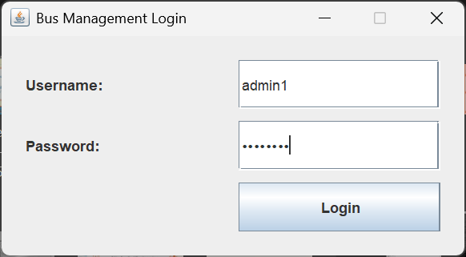
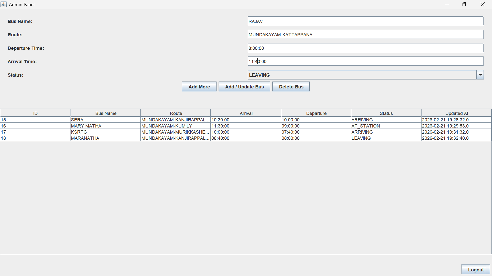
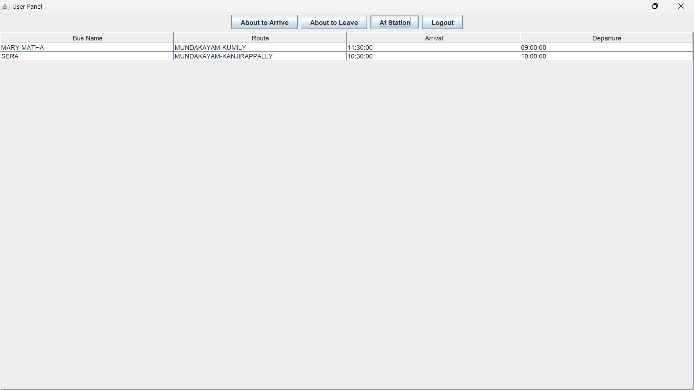

# Bus_station_management_system
This project aims to solve the challenges faced by everyday commuters who use public transport in India.

## Team Members

* Abhishek V Nair
* Andrews R Kattoor


---

## Problem Statement

Existing Bus Management System in many or all parts of India has some serious drawbacks:
- Passengers are entirely dependent on enquiry office staffs who may/may not be nice to the passengers.
- The public announcements made are barely understandable to anyone.
- Quarrels often arise between bus drivers over departure/arrival time at station.
- Delay/cancellation of a bus service isn't informed timely. 

---

## Objective

Our objective is to create a Bus Station Management System that solves some or all of the above mentioned problems using simple Java UI(using swings), and a basic database.
- Station staff can update name, route, departure time, arrival time at destination and current status(at_staiton, arriving, leaving) of buses using admin login.
- Passengers can view bus details under three tables- Arriving, Leaving, At_station using user login.

---

## Features

* Separate login for users and admin.
* Admin Panel:

  * Add Bus Details
  * Update Bus Records
  * Delete Bus Records
* User Panel:

  * View Arriving Buses
  * View Departing Buses
  * View Buses at Station
* MySQL Database Integration
* Java Swing GUI

---

## Technologies Used

* Java
* Java Swing
* JDBC
* MySQL
* Git & GitHub

---

## Project Structure

```
Bus-Station-Management-System/
│
├── src/
│   ├── LoginPage.java
│   ├── AdminPanel.java
│   └── UserPanel.java
|   └── DBConnection.java
│
├── database/
│   └── bus_management.sql
│
├── screenshots/
│
└── README.md
```

---

## Database Setup

1. Open MySQL Workbench.
2. Create a new schema named:

   ```
   `bus_management`
   ```
3. Go to **Server → Data Import**
4. Choose **Import from Self-Contained File**
5. Select `bus_management.sql` from the `database` folder.
6. Click **Start Import**

---

## Steps to Run the Program

1. Install Java (JDK 8 or above).
2. Install MySQL and ensure the server is running.
3. Import the database using `busdb.sql`.
4. Open the project in an IDE (IntelliJ / Eclipse / NetBeans).
5. Ensure database credentials in `DatabaseConnection.java` match your MySQL settings.
6. Run `LoginPage.java`.

---

## Sample Test Case

### Test Case 1 – Admin Login

**Input:**

```
Username: admin
Password: admin123
```

**Expected Output:**
Admin Panel opens successfully.

---

### Test Case 2 – Add Bus Record

**Input:**

* Bus Name: KSRTC 101
* Route: Kottayam – Kochi
* Arrival Time: 10:30 AM
* Departure Time: 10:45 AM
* Status: At Station

**Expected Output:**
Bus appears in:

* Admin table
* User panel under “At Station”

---

## Screenshots

(Add images inside the `screenshots` folder and reference them like this)

```
## Login Page


## Admin Panel


## User Panel

```

---

## Optional: Video Demonstration

(Add Google Drive or YouTube link here if available)

---


I can customize this README perfectly to match your real project structure.

